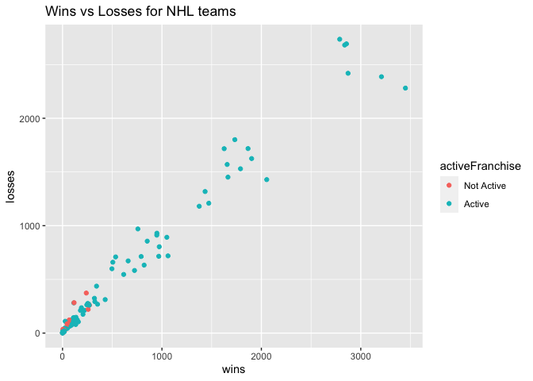
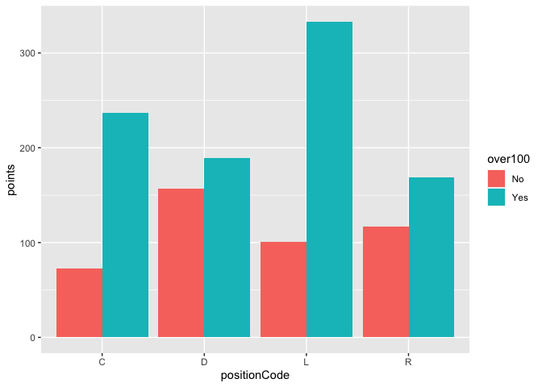
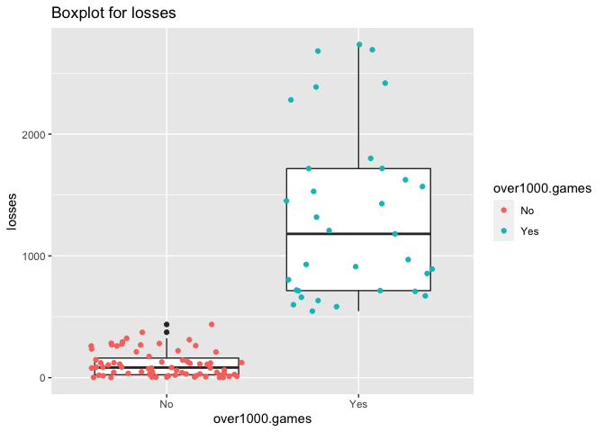
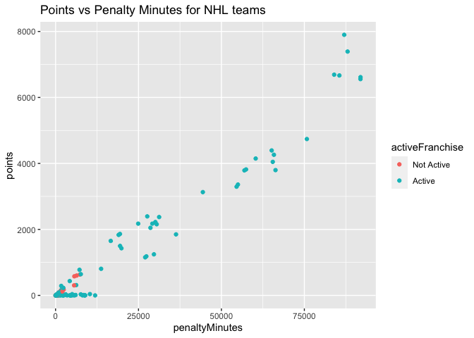

JSON Data - A Vignette by Saara Raja
================

-   [JSON Data Overview](#json-data-overview)
    -   [Data Structure](#data-structure)
-   [Reading JSON Data into R](#reading-json-data-into-r)
    -   [rjson and rjsonio](#rjson-and-rjsonio)
    -   [jsonlite](#jsonlite)
    -   [tidyjson](#tidyjson)
-   [Example Analytics Process using JSON Data](#example-analytics-process-using-json-data)
    -   [Connecting to and parsing JSON data](#connecting-to-and-parsing-json-data)
    -   [Exploratory Data Analysis](#exploratory-data-analysis)

JSON Data Overview
------------------

**JSON**, or Java Script Object Notation, Data is a purely text-based way of storing data and is the primary way of data storage/retrieval of web information. Because of its simplistic text format, JSON data is easy to read and understand by humans, while also enabling easy data parsing by a computer, hence its popularity. XML, an alternative text-based data interchange method, has a much more complex/verbose syntax and is more challenging for humans to code and understand, causing JSON to eclipse it as the most popular method of exchanging web information. JSON is the most popular method of extracting data from REST APIs, so having a good understanding of the format is valuable for any analytics on web-based data.

### Data Structure

The JSON data structure is in the form of nested key-value pairs and ordered lists. The following image shows the general format of JSON data. The original image along with more information can be found [here](https://www.goanywhere.com/managed-file-transfer/more/tutorials/parse-json-data-into-database).


As we can see from the image, JSON objects are created within `{}` curly brackets and each variable is paired with its value is `"key":"value"` format. All values are placed within double quotes, whether they are of character or numeric type. Data can also have multiple values that is depicted using `[]` square brackets to show arrays. Arrays are an ordered list of key-value pairs, separated by commas.

In this particular image, there is a JSON object called "orders" which has several attributes ("orderno", "date", "trackingno", etc) that are displayed as nested key-value pairs in an array . This nested format shows that each of these variables is related to the original parent variable "orders". In addition, the variable "customer" has further attributes of its own, which are displayed in a 3rd layer nested key-value pairs in an array.

Further information on JSON data can be found [here](https://www.infoworld.com/article/3222851/what-is-json-a-better-format-for-data-exchange.html).

Reading JSON Data into R
------------------------

Since JSON data is purely text-based, it needs to be parsed in order to use in databases or in programming platforms. To read and parse JSON data into R, there are 4 main packages: `rjson`, `rjsonio`, `jsonlite`, and `tidyjson`.

### rjson and rjsonio

Both `rjson` and `rjsonio` have the same functionality and same basic interface. `rjson` was the first package created for translating between R and JSON, and `rjsonio` was created subsequently to perform the same task more quickly, though now both packages have comparable efficiency.

Both packages have two basic functions: `fromJSON("file.json")` for converting JSON files into R objects and `toJSON(x)` to convert an R object x into a JSON file. The default R object created when reading in JSON data is a list with sublists for any nested information.

Additional information for how to work with `rjson` and `rjsonio` can be found here: [rjson tutorial](https://www.tutorialspoint.com/r/r_json_files.htm) and [rjsonio tutorial](http://zevross.com/blog/2015/02/12/using-r-to-download-and-parse-json-an-example-using-data-from-an-open-data-portal/)

### jsonlite

Reading and analyzing data in nested lists can be complicated. Therefore, the `jsonlite` package, reads and parses JSON data into R directly as dataframes. The same function, `fromJSON("file.json")` is used to accomplish this.

Nested data from the JSON file is displayed by default as dataframes within the main data frame. In order to convert the result into a single data frame, the `flatten()` function can be used on the object. This causes any nested dataframes to be converted to a single column as much as possible. This flattening is not perfect, and additional data manipulation may be necessary to create a final dataset in the desired manner.

Additional information for how to work with `jsonlite` can be found here: [jsonlite tutorial](https://blog.exploratory.io/working-with-json-data-in-very-simple-way-ad7ebcc0bb89)

### tidyjson

The `tidyjson` package is the last major method of reading JSON data into R. Like `jsonlite`, it also directly parses JSON data into dataframes, but it also has very simple functions for tackling nested data frames, and enables the object to be used directly with functions from the `tidyverse` along with `$>%`piping.

Using `tidyjson`, we can create a dataframe of the data directly at the nesting level that we are interested in examining. Using the functions `jsondata %>% enter_object(object_name) %>% gather_array %>% spread_all`: `tidyjson` dives into the nested object "object\_name" within the JSON data, gathers the array values and then spreads them into individual variables in the final data frame.

Because of the ease of manipulating JSON data into data frames that can be used along with the `tidyverse` functions, I have chosen this method to conduct the further analyses in this vignette.

Additional information for how to work with `tidyjson` can be found here: [tidyjson tutorial](https://rdrr.io/cran/tidyjson/f/vignettes/introduction-to-tidyjson.Rmd)

Example Analytics Process using JSON Data
-----------------------------------------

In this part of the vignette, I will demonstrate how to read in JSON data from the National Hockey League (NHL) API, convert that data into useable tidy data frames, and then perform exploratory data analysis.

### Connecting to and parsing JSON data

Here, I will show how to connect to the NHL API and extract the JSON data. Each function has the same basic structure:

1.  Connect to the API
2.  Grab the content of the API as text
3.  Convert the JSON-structured text into a tidy dataframe
4.  Keep the relevant data columns

We will be creating 5 different data frames from JSON datasets: 1) franchise, 2) franch\_total, 3) franch\_season, 4) franch\_goalie, and 5) franch\_skater.

-   Function to create the dataframe "franchise". This data set will contain the team names, first and last season IDs for each team in the NHL.

``` r
base <- "https://records.nhl.com/site/api"

franch_func <- function(){
  
  #url ending
  endpoint <- "/franchise"
  
  #Create the url & read in the data 
  call1 <- paste0(base, endpoint)
  get_json <- GET(call1)
  get_json_text <- content(get_json, "text")
  
  #use tidyjson to convert the data into a useable dataframe
  df_prelim <- get_json_text %>% enter_object(data) %>% gather_array %>% spread_all
  df <- as_tibble(df_prelim) 
  df <- df %>% select(-document.id, -array.index)
  return(df)
}
```

-   Calling the function and displaying the dataframe:

``` r
franchise <- franch_func() 
franchise
```

    ## # A tibble: 38 x 6
    ##       id firstSeasonId lastSeasonId mostRecentTeamId teamCommonName
    ##    <dbl>         <dbl>        <dbl>            <dbl> <chr>         
    ##  1     1      19171918           NA                8 Canadiens     
    ##  2     2      19171918     19171918               41 Wanderers     
    ##  3     3      19171918     19341935               45 Eagles        
    ##  4     4      19191920     19241925               37 Tigers        
    ##  5     5      19171918           NA               10 Maple Leafs   
    ##  6     6      19241925           NA                6 Bruins        
    ##  7     7      19241925     19371938               43 Maroons       
    ##  8     8      19251926     19411942               51 Americans     
    ##  9     9      19251926     19301931               39 Quakers       
    ## 10    10      19261927           NA                3 Rangers       
    ## # … with 28 more rows, and 1 more variable: teamPlaceName <chr>

-   Function to create the dataframe "franch\_total". This data set will contain the total stats for each franchise.

``` r
franch_total_func <- function(){
  
  #url ending
  endpoint <- "/franchise-team-totals"
  
  #Create the url & read in the data 
  call1 <- paste0(base, endpoint)
  get_json <- GET(call1)
  get_json_text <- content(get_json, "text")
  
  #use tidyjson to convert the data into a useable dataframe
  df_prelim <- get_json_text %>% enter_object(data) %>% gather_array %>% spread_all
  df <- as_tibble(df_prelim) 
  df <- df %>% select(-document.id, -array.index)
  return(df)
}
```

-   Calling the function and displaying the dataframe:

``` r
franch_total <- franch_total_func()
franch_total
```

    ## # A tibble: 104 x 30
    ##       id activeFranchise firstSeasonId franchiseId gameTypeId gamesPlayed
    ##    <dbl>           <dbl>         <dbl>       <dbl>      <dbl>       <dbl>
    ##  1     1               1      19821983          23          2        2937
    ##  2     2               1      19821983          23          3         257
    ##  3     3               1      19721973          22          2        3732
    ##  4     4               1      19721973          22          3         272
    ##  5     5               1      19261927          10          2        6504
    ##  6     6               1      19261927          10          3         515
    ##  7     7               1      19671968          16          3         433
    ##  8     8               1      19671968          16          2        4115
    ##  9     9               1      19671968          17          2        4115
    ## 10    10               1      19671968          17          3         381
    ## # … with 94 more rows, and 24 more variables: goalsAgainst <dbl>,
    ## #   goalsFor <dbl>, homeLosses <dbl>, homeOvertimeLosses <dbl>, homeTies <dbl>,
    ## #   homeWins <dbl>, lastSeasonId <dbl>, losses <dbl>, overtimeLosses <dbl>,
    ## #   penaltyMinutes <dbl>, pointPctg <dbl>, points <dbl>, roadLosses <dbl>,
    ## #   roadOvertimeLosses <dbl>, roadTies <dbl>, roadWins <dbl>,
    ## #   shootoutLosses <dbl>, shootoutWins <dbl>, shutouts <dbl>, teamId <dbl>,
    ## #   teamName <chr>, ties <dbl>, triCode <chr>, wins <dbl>

-   Function to create the dataframe "franch\_season". This data set will contain season-specific records for one particular franchise. The user can specify the franchise ID for the franchise that they would like to dig into.

``` r
franch_season_func <- function(number){
  
  #url ending
  endpoint <- "/franchise-season-records?cayenneExp=franchiseId="
  
  #Create the url & read in the data 
  call1 <- paste0(base, endpoint, number)
  get_json <- GET(call1)
  get_json_text <- content(get_json, "text")
  
  #use tidyjson to convert the data into a useable dataframe
  df_prelim <- get_json_text %>% enter_object(data) %>% gather_array %>% spread_all
  df <- as_tibble(df_prelim) 
  df <- df %>% select(-document.id, -array.index)
  return(df)
}
```

-   Calling the function and displaying the dataframe for Franchise 3:

``` r
franch_season <- franch_season_func(3)
franch_season
```

    ## # A tibble: 1 x 57
    ##      id fewestGoals fewestGoalsAgai… fewestGoalsAgai… fewestGoalsSeas…
    ##   <dbl> <lgl>       <lgl>            <lgl>            <lgl>           
    ## 1    36 NA          NA               NA               NA              
    ## # … with 52 more variables: fewestLosses <lgl>, fewestLossesSeasons <lgl>,
    ## #   fewestPoints <lgl>, fewestPointsSeasons <lgl>, fewestTies <lgl>,
    ## #   fewestTiesSeasons <lgl>, fewestWins <lgl>, fewestWinsSeasons <lgl>,
    ## #   franchiseId <dbl>, franchiseName <chr>, homeLossStreak <dbl>,
    ## #   homeLossStreakDates <chr>, homePointStreak <dbl>,
    ## #   homePointStreakDates <chr>, homeWinStreak <dbl>, homeWinStreakDates <chr>,
    ## #   homeWinlessStreak <dbl>, homeWinlessStreakDates <chr>, lossStreak <dbl>,
    ## #   lossStreakDates <chr>, mostGameGoals <dbl>, mostGameGoalsDates <chr>,
    ## #   mostGoals <dbl>, mostGoalsAgainst <dbl>, mostGoalsAgainstSeasons <chr>,
    ## #   mostGoalsSeasons <chr>, mostLosses <dbl>, mostLossesSeasons <chr>,
    ## #   mostPenaltyMinutes <dbl>, mostPenaltyMinutesSeasons <chr>,
    ## #   mostPoints <dbl>, mostPointsSeasons <chr>, mostShutouts <dbl>,
    ## #   mostShutoutsSeasons <chr>, mostTies <dbl>, mostTiesSeasons <chr>,
    ## #   mostWins <dbl>, mostWinsSeasons <chr>, pointStreak <dbl>,
    ## #   pointStreakDates <chr>, roadLossStreak <dbl>, roadLossStreakDates <chr>,
    ## #   roadPointStreak <dbl>, roadPointStreakDates <chr>, roadWinStreak <dbl>,
    ## #   roadWinStreakDates <chr>, roadWinlessStreak <dbl>,
    ## #   roadWinlessStreakDates <chr>, winStreak <dbl>, winStreakDates <chr>,
    ## #   winlessStreak <lgl>, winlessStreakDates <lgl>

-   Function to create the dataframe "franch\_goalie". This data set will contain goalie records for one particular franchise. The user can specify the franchise ID for the franchise that they would like to dig into.

``` r
franch_goalie_func <- function(number){
  
  #url ending
  endpoint <- "/franchise-goalie-records?cayenneExp=franchiseId="
  
  #Create the url & read in the data 
  call1 <- paste0(base, endpoint, number)
  get_json <- GET(call1)
  get_json_text <- content(get_json, "text")
  
  #use tidyjson to convert the data into a useable dataframe
  df_prelim <- get_json_text %>% enter_object(data) %>% gather_array %>% spread_all
  df <- as_tibble(df_prelim) 
  df <- df %>% select(-document.id, -array.index)
  return(df)
}
```

-   Calling the function and displaying the dataframe for Franchise 3:

``` r
franch_goalie <- franch_goalie_func(3)
franch_goalie
```

    ## # A tibble: 4 x 29
    ##      id activePlayer firstName franchiseId franchiseName gameTypeId gamesPlayed
    ##   <dbl> <lgl>        <chr>           <dbl> <chr>              <dbl>       <dbl>
    ## 1   248 FALSE        Alec                3 St. Louis Ea…          2         294
    ## 2   538 FALSE        Bill                3 St. Louis Ea…          2          90
    ## 3   600 FALSE        Sammy               3 St. Louis Ea…          2           2
    ## 4  1231 FALSE        Clint               3 St. Louis Ea…          2         158
    ## # … with 22 more variables: lastName <chr>, losses <dbl>,
    ## #   mostGoalsAgainstDates <chr>, mostGoalsAgainstOneGame <dbl>,
    ## #   mostSavesDates <lgl>, mostSavesOneGame <lgl>, mostShotsAgainstDates <lgl>,
    ## #   mostShotsAgainstOneGame <lgl>, mostShutoutsOneSeason <dbl>,
    ## #   mostShutoutsSeasonIds <chr>, mostWinsOneSeason <dbl>,
    ## #   mostWinsSeasonIds <chr>, overtimeLosses <lgl>, playerId <dbl>,
    ## #   positionCode <chr>, rookieGamesPlayed <dbl>, rookieShutouts <dbl>,
    ## #   rookieWins <dbl>, seasons <dbl>, shutouts <dbl>, ties <dbl>, wins <dbl>

-   Function to create the dataframe "franch\_skater". This data set will contain skater records for one particular franchise. The user can specify the franchise ID for the franchise that they would like to dig into.

``` r
franch_skater_func <- function(number){
  
  #url ending
  endpoint <- "/franchise-skater-records?cayenneExp=franchiseId="
  
  #Create the url & read in the data 
  call1 <- paste0(base, endpoint, number)
  get_json <- GET(call1)
  get_json_text <- content(get_json, "text")
  
  #use tidyjson to convert the data into a useable dataframe
  df_prelim <- get_json_text %>% enter_object(data) %>% gather_array %>% spread_all
  df <- as_tibble(df_prelim) 
  df <- df %>% select(-document.id, -array.index)
  return(df)
}
```

-   Calling the function and displaying the dataframe for Franchise 3:

``` r
franch_skater <- franch_skater_func(3)
franch_skater
```

    ## # A tibble: 90 x 30
    ##       id activePlayer assists firstName franchiseId franchiseName gameTypeId
    ##    <dbl> <lgl>          <dbl> <chr>           <dbl> <chr>              <dbl>
    ##  1 16907 FALSE            100 Frank               3 St. Louis Ea…          2
    ##  2 16979 FALSE             67 Frank               3 St. Louis Ea…          2
    ##  3 16985 FALSE             87 Cy                  3 St. Louis Ea…          2
    ##  4 17012 FALSE             75 George              3 St. Louis Ea…          2
    ##  5 17047 FALSE             57 Hec                 3 St. Louis Ea…          2
    ##  6 17067 FALSE             72 King                3 St. Louis Ea…          2
    ##  7 17104 FALSE             29 Hooley              3 St. Louis Ea…          2
    ##  8 17150 FALSE             46 Joe                 3 St. Louis Ea…          2
    ##  9 17209 FALSE              1 Jack                3 St. Louis Ea…          2
    ## 10 17352 FALSE              7 Ossie               3 St. Louis Ea…          2
    ## # … with 80 more rows, and 23 more variables: gamesPlayed <dbl>, goals <dbl>,
    ## #   lastName <chr>, mostAssistsGameDates <chr>, mostAssistsOneGame <dbl>,
    ## #   mostAssistsOneSeason <dbl>, mostAssistsSeasonIds <chr>,
    ## #   mostGoalsGameDates <chr>, mostGoalsOneGame <dbl>, mostGoalsOneSeason <dbl>,
    ## #   mostGoalsSeasonIds <chr>, mostPenaltyMinutesOneSeason <dbl>,
    ## #   mostPenaltyMinutesSeasonIds <chr>, mostPointsGameDates <chr>,
    ## #   mostPointsOneGame <dbl>, mostPointsOneSeason <dbl>,
    ## #   mostPointsSeasonIds <chr>, penaltyMinutes <dbl>, playerId <dbl>,
    ## #   points <dbl>, positionCode <chr>, rookiePoints <dbl>, seasons <dbl>

### Exploratory Data Analysis

Now that the JSON API data is in dataframe form, I will demonstrate how data exploration can be performed.

#### Do Teams usually win more on the road or lose more on the road vs at home?

This code is used to calculate whether teams tend to win or lose more on the road, and whether they tend to win or lose more at home. New variables are created comparing their win/loss rate both on the road and at home, and the frequency of these variables is then displayed in a two-way contingency table.

``` r
#Create a variable based on win/loss rate on the road
for(i in 1:length(franch_total$roadWins)) {
  if((franch_total$roadWins[i] > franch_total$roadLosses[i])){
            franch_total$RoadStats[i] <- "Win More on Road"
        }
  else if((franch_total$roadWins[i] < franch_total$roadLosses[i])){
            franch_total$RoadStats[i] <- "Lose More on Road"
        }
  else{
        franch_total$RoadStats[i] <- "Equal"
        }
}

#Create a variable based on win/loss rate at home
for(i in 1:length(franch_total$homeWins)) {
  if((franch_total$homeWins[i] > franch_total$homeLosses[i])){
            franch_total$homeStats[i] <- "Win More at Home"
        }
  else if((franch_total$homeWins[i] < franch_total$homeLosses[i])){
            franch_total$homeStats[i] <- "Lose More at Home"
        }
  else{
        franch_total$homeStats[i] <- "Equal"
        }
}
```

Frequency of Teams that Wins/Lose more at Home vs on the Road:

``` r
#Create a two-way table showing the rates of win/loss at home vs on the road
kable(table(franch_total$homeStats, franch_total$RoadStats))
```

|                   |  Equal|  Lose More on Road|  Win More on Road|
|-------------------|------:|------------------:|-----------------:|
| Equal             |      0|                  2|                 0|
| Lose More at Home |      1|                 27|                 2|
| Win More at Home  |      1|                 61|                10|

Based on the contingency table, the majority of teams win more at home and lose more on the road.

#### What is the relationship between overall wins and losses per team?

The number of wins and losses per team is visualized in a scatter plot. According to the scatter plot below, there is a positive relationship between wins and losses per team, meaning that teams that have more wins also have more losses. After color coding by whether a franchise is active or not, it seems that the inactive teams have lower wins and losses in general compared to most of the active teams.

``` r
franch_total$activeFranchise <- factor(franch_total$activeFranchise, levels = c(0, 1), labels = c("Not Active", "Active"))

g1 <- ggplot(franch_total, aes(x=wins, y=losses, color = activeFranchise))
g1 + geom_point() + labs(title="Wins vs Losses for NHL teams")
```



#### What is the distribution of goals, assists, points and seasons per Skater position in franchise 3?

A 5 number summary (Minimum, 1st Quartile, Median, Mean, 3rd Quartile, Maximum) is created for the number of goals, assists, points, and seasons for each of the skater positions. Upon examining the results, on average, position R has the highest number of goals, assists, and points.

``` r
library(tidyverse)

#create function
num_tbl <- function(player_position) {
  player_stats <- franch_skater %>% filter(positionCode == player_position) %>% select(goals, assists, points, seasons)
  return(kable(apply(player_stats, 2, summary), caption = paste("Summary of Player Stats for position:", player_position), digit = 1))
}
```

Summary of Player Stats for position C

``` r
#call function
num_tbl("C")
```

|         |  goals|  assists|  points|  seasons|
|---------|------:|--------:|-------:|--------:|
| Min.    |    0.0|      0.0|     0.0|      1.0|
| 1st Qu. |    1.8|      1.8|     3.8|      1.0|
| Median  |    6.5|      7.0|    11.5|      2.0|
| Mean    |   18.4|     16.1|    34.4|      2.6|
| 3rd Qu. |   18.5|     20.0|    35.2|      2.2|
| Max.    |  137.0|    100.0|   237.0|     13.0|

Summary of Player Stats for position R

``` r
num_tbl("R")
```

|         |  goals|  assists|  points|  seasons|
|---------|------:|--------:|-------:|--------:|
| Min.    |    0.0|      0.0|     0.0|      1.0|
| 1st Qu. |    2.0|      1.5|     3.5|      1.0|
| Median  |    7.0|      7.0|    13.0|      2.0|
| Mean    |   21.3|     14.9|    36.2|      2.7|
| 3rd Qu. |   21.0|     17.0|    36.0|      3.0|
| Max.    |  102.0|     67.0|   169.0|     11.0|

Summary of Player Stats for position L

``` r
num_tbl("L")
```

|         |  goals|  assists|  points|  seasons|
|---------|------:|--------:|-------:|--------:|
| Min.    |    0.0|      0.0|     0.0|      1.0|
| 1st Qu. |    0.0|      0.0|     0.0|      1.0|
| Median  |    1.0|      2.0|     3.0|      1.0|
| Mean    |   20.9|     12.8|    33.6|      2.5|
| 3rd Qu. |   13.0|     17.0|    30.0|      3.0|
| Max.    |  246.0|     87.0|   333.0|     11.0|

``` r
num_tbl("D")
```

|         |  goals|  assists|  points|  seasons|
|---------|------:|--------:|-------:|--------:|
| Min.    |    0.0|      0.0|     0.0|      1.0|
| 1st Qu. |    0.0|      1.0|     1.0|      1.0|
| Median  |    2.0|      2.0|     6.0|      1.0|
| Mean    |   10.8|      8.9|    19.6|      2.5|
| 3rd Qu. |    5.8|      5.0|    10.8|      3.0|
| Max.    |  114.0|     75.0|   189.0|     12.0|

Summary of Player Stats for position D

``` r
num_tbl("D")
```

|         |  goals|  assists|  points|  seasons|
|---------|------:|--------:|-------:|--------:|
| Min.    |    0.0|      0.0|     0.0|      1.0|
| 1st Qu. |    0.0|      1.0|     1.0|      1.0|
| Median  |    2.0|      2.0|     6.0|      1.0|
| Mean    |   10.8|      8.9|    19.6|      2.5|
| 3rd Qu. |    5.8|      5.0|    10.8|      3.0|
| Max.    |  114.0|     75.0|   189.0|     12.0|

#### What are the total number of points scored for skaters who scored over 100 goals or under 100 goals?

This side-by-side bar chart shows the total number of points scored for skaters who scored over 100 goals and under 100 goals, and split into groups by their position. This graph shows that in aggregate, players who scored more than 100 goals, scored more points.

``` r
franch_skater$over100 <- "Yes"
franch_skater[franch_skater$goals < 100, "over100"] <- "No"

g2 <- ggplot(franch_skater, aes(x=positionCode, y=points, fill=over100)) 
g2 + geom_bar(stat='identity', position='dodge')
```



#### What is the distribution of losses for teams who have played over 1000 games vs teams who have played less?

These boxplots show the distribution of losses for teams, split by whether they have played over 1000 games or not. The results show that teams that have played more games, have also accrued more losses.

``` r
franch_total$over1000.games <- "Yes"
franch_total[franch_total$gamesPlayed <= 1000, "over1000.games"] <- "No"

g3 <- ggplot(franch_total, aes(x=over1000.games, y=losses))
g3 + geom_boxplot()  + labs(title="Boxplot for losses") + geom_jitter(aes(color=over1000.games))
```



#### What is the relationship between penalty minutes and points?

``` r
g4 <- ggplot(franch_total, aes(x=penaltyMinutes, y=points, color = activeFranchise))
g4 + geom_point() + labs(title="Points vs Penalty Minutes for NHL teams")
```


